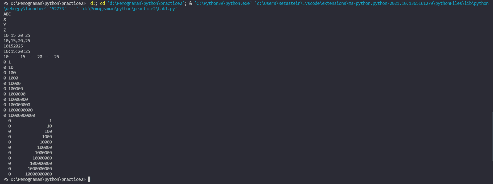
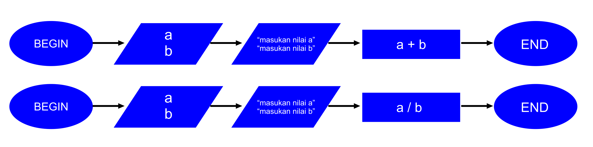
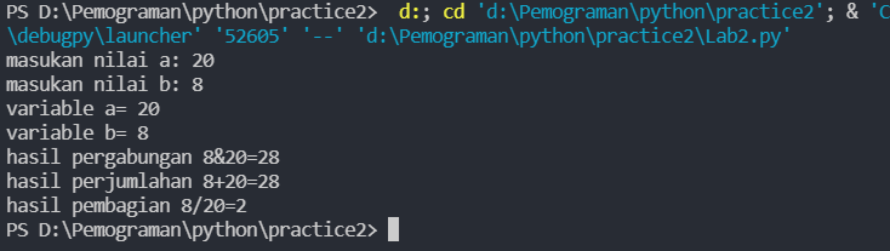
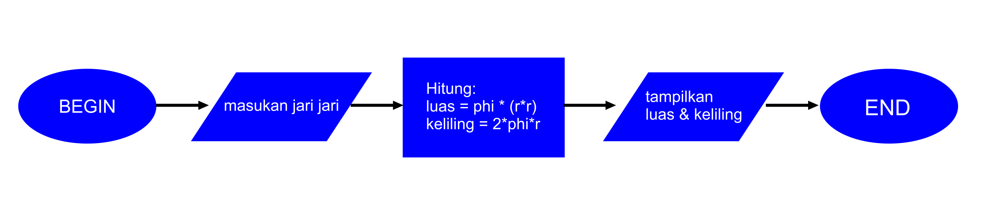
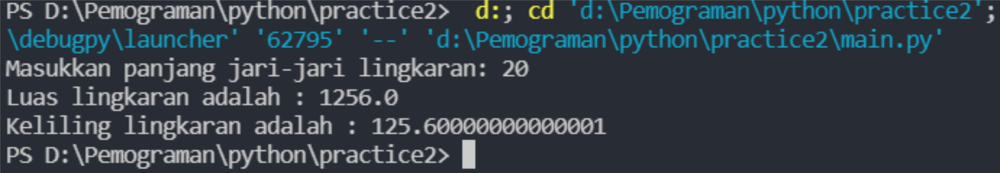

# **Program untuk menghitung luas dan keliling lingkaran**

[](https://www.instagram.com/rezastein_) [](https://www.instagram.com/rezastein_) [](https://www.instagram.com/rezastein_)

### Connect with me:

[](https://officialeinsteinpro.wordpress.com/)
[](https://www.youtube.com/channel/UCNKeQLX0b-a65ZVLIPlhc9w)
[](https://twitter.com/rezastein_)
[](https://www.facebook.com/rezastein.rezastein)

[](https://www.instagram.com/rezastein_)
<br />
## **Lab 1**
- **END**

```sh
print('A', end='')
```
**END** adalah karakter yang dicetak di akhir baris. Defaultnya adalah tanda newline (baris baru).

jadi penggunaan **END** menandakan penggunaan untuk newline/barisbaru

- **sparator**
```sh
print(w, x, y, z, sep=',')
```

**SEP** adalah pemisah(separator) yang berfungsi sebagai tanda pemisah antar objek yang dicetak. Defaultnya adalah tanda spasi.

- **formating string**

**formating string** adalah fitur Python yang paling keren adalah format string operator %. Operator ini unik untuk string dan membuat paket memiliki fungsi dari keluarga printf C () C. 
berikut adalah contoh sederhananya : 
```sh
print('{0:>3} {1:>16}'.format(0, 10**0))
```
**SCREENSHOT OUTPUT PROGRAM**


## **Lab 2**
## input
- variable
```sh
a = 
b =
```
- input pada variable 
```sh
a = input("masukan nilai a: "))
b = input("masukan nilai b: "))
```
- type data pada input
<br> Type data **string/text** adalah **str**
<br> Type data **integer/angka** adalah **int**
```sh
a = int(input("masukan nilai a: "))
b = int(input("masukan nilai b: "))
```
## output
- Arithmetic Operators
<br/>
variable **a**+**b** 
```sh
print("hasil pergabungan {1}&{0}=%d".format(a,b) %(a+b))
```
##  **konversi bilangan variable**
## input
- input pada variable ber type data
```sh
a=int(a)
b=int(b)
```

## output
- Arithmetic Operators
<br>
variable **a**+**b** 
<br>
variable **a**/**b** 
```sh
print("hasil perjumlahan {1}+{0}=%d".format(a,b) %(a+b))
print("hasil pembagian {1}/{0}=%d".format(a,b) %(a/b))
```
### **FLOWCART**

### **SCREENSHOT PROGRAM**


## **Program menghitung luas keliling lingkaran**

### Rumus Luas & Keliling Lingkaran
```sh
Luas     = π × r²
Keliling = 2 x π × r
```
- Nilai Phi yang akan digunakan adalah 3.14
- r merupakan jari-jari lingkaran

Phi merupakan nilai konstanta di matematika sementara jari-jari merupakan jarak antara titik pusat dengan tepi lingkaran. Sebetulnya ada rumus lain untuk menghitung keliling lingkaran yaitu dengan menggunakan diameter, tapi pada kasus ini kita cukup menggunakan jari jari lingkaran saja.

```sh
phi = 3.14
r = float(input("Masukkan panjang jari-jari lingkaran: "))

luas = phi*(r*r)
keliling = 2*phi*r

print("Luas lingkaran adalah : "+ str(luas))
print("Keliling lingkaran adalah : "+ str(keliling))
```
**Float** adalah tipe data yang menampung bilang desimal/pecahan.

## **FLOWCART**

## **SCREENSHOT PROGRAM**

